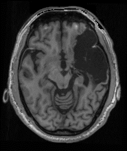

# Semantic Segmentation of MRI Images Using Various Deep Learning Models





## Dependencies
- Python 3.8
- [PyTorch](https://pytorch.org/)
- [NiBabel](https://nipy.org/nibabel/)
- [scikit-image](https://scikit-image.org/)
- [scikit-learn](https://scikit-learn.org/)
- monai


# Reference
Reference:

```Liew, Sook-Lei. The Anatomical Tracings of Lesions after Stroke (ATLAS) Dataset - Release 2.0, 2021. Inter-university Consortium for Political and Social Research / https://doi.org/10.3886/ICPSR36684.v4```

```Hatamizadeh, A., Tang, Y., Nath, V., Yang, D., Myronenko, A., Landman, B., ... & Xu, D. (2022). Unetr: Transformers for 3d medical image segmentation. In Proceedings of the IEEE/CVF Winter Conference on Applications of Computer Vision (pp. 574-584).```

```Tomita, N., Jiang, S., Maeder, M. E., & Hassanpour, S. (2020). Automatic post-stroke lesion segmentation on MR images using 3D residual convolutional neural network. NeuroImage: Clinical, 27, 102276.```
